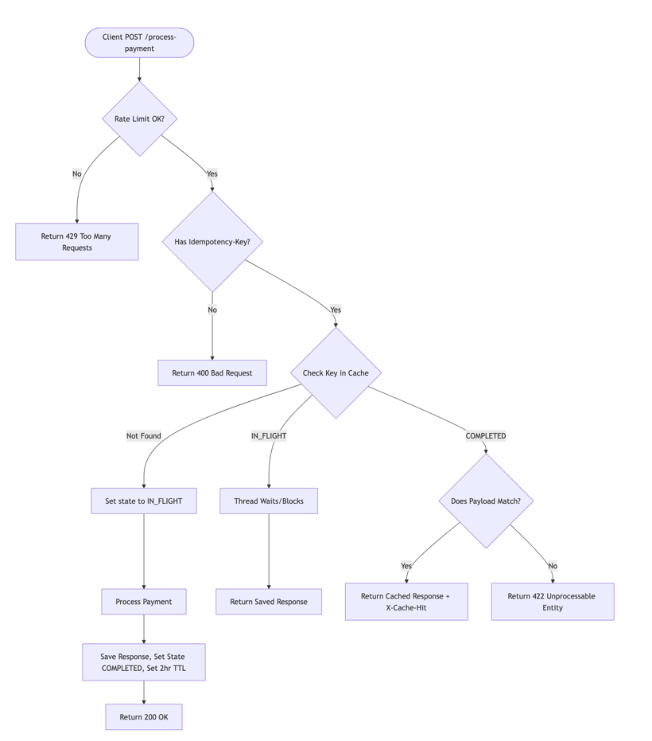

# Payment Gateway API

A simple and reliable Spring Boot payment gateway service. I built this using Test-Driven Development (TDD) to make sure it handles payments safely, prevents double-charging, and stops users from spamming the API.

---

## Architecture



*Architecture diagram*

---

## Features

* **No Double Charging (Idempotency):** If a user accidentally sends the same payment request twice, the system recognizes the duplicate `Idempotency-Key` header and returns the original response instead of charging them again.
* **Test-Driven Design:** Everything is covered by automated tests to make sure the rate limiting, duplicate checking, and error handling work exactly as expected.
* **Clear Error Handling:** Returns helpful error messages and the right HTTP status codes when headers are missing or limits are reached.

### Bonus Enhancements
I added a few extra features to make the project stand out:
* **Custom Rate Limiter:** Instead of pulling in big external libraries, I built a simple rate limiter from scratch using standard Java. It keeps track of request times to easily block users who send too many requests in a minute.
* **Smart Cache Cleanup:** To keep the app running fast and save memory, the system automatically deletes old, expired payment records (older than 2 hours) as new requests come in. This avoids the need to set up complicated background cleanup jobs.

---

## Tech Stack

* **Language:** Java 17
* **Framework:** Spring Boot 4.1.0
* **Build Tool:** Gradle 9.5.1
* **Testing:** JUnit 5, Mockito, Spring MockMvc

---

## Getting Started

### Prerequisites
* JDK 17
* Gradle 9.5.1 (or just use the included `./gradlew` wrapper)

### Installation & Run

1. Clone the repository:
   ```bash
   git clone git@github.com:embashbaz/AmaliTech-DEG-Project-based-challenges.git
   ```

2. Run the tests to make sure everything works:
   ```bash
   ./gradlew test
   ```

3. Start the application:
   ```bash
   ./gradlew bootRun
   ```
   The API will be available locally at `http://localhost:8080`.

---

## API Documentation

### Process Payment

* **Endpoint:** `POST /process-payment`
* **Content-Type:** `application/json`

#### Headers
| Header Name | Type | Required | Description |
| :--- | :--- | :--- | :--- |
| `Idempotency-Key` | String | **Yes** | A unique string (like a UUID) for the request to prevent duplicate charges. |
| `X-Client-Id` | String | No | A client ID used to track and limit how many requests a user makes. Defaults to `default-client`. |

#### Sample Request Body
```json
{
  "amount": 5000,
  "currency": "RWF"
}
```

#### Sample Successful Response
```text
Charged 5000 RWF
```

#### HTTP Response Statuses
| Status Code | Description |
| :--- | :--- |
| `200 OK` | Payment was successful (or the cached result of a previous successful payment). |
| `400 Bad Request` | You are missing a required header or the JSON body is wrong. |
| `429 Too Many Requests` | You have sent too many requests in a short time. Try again later. |

---

## Project Structure

```text
src/
├── main/java/com/example/solution/
│   ├── controller/
│   │   └── PaymentController.java
│   ├── model/
│   │   ├── IdempotencyRecord.java
│   │   └── PaymentRequest.java
│   └── service/
│       ├── IdempotencyService.java
│       └── RateLimiterService.java
└── test/java/com/example/solution/
    ├── controller/
    │   └── PaymentControllerTest.java
    └── service/
        ├── IdempotencyServiceTest.java
        └── RateLimiterServiceTest.java
```
